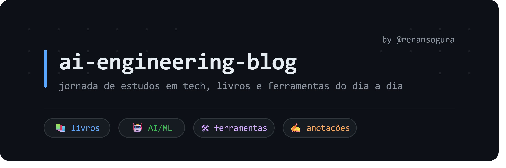

Esse espaço é o meu caderno público onde compartilho conhecimentos que considero relevantes para o meu desenvolvimento como AI Engineering.

Recentemente iniciei minha jornada profissional como ai engineering e decidi iniciar a construção de um blog aonde posso compartilhar conhecimentos que adquiro sob o meu ponto de vista. Não é um blog técnico perfeito. Tem dúvida, erro, descoberta. Se você também está nessa jornada, talvez encontre algo útil aqui.

**Livros:**

Nessa pasta você vai encontrar livros técnicos e não técnicos e a ideia não é realizar um resumo, mas sim mostrar qual a minha interpretação diante do tema apresentado no livro ou até mesmo no capítulo. 

**Ferramentas:**

Esse módulo gostaria de compartilhar as ferramentas de trabalho que estou utilizando no meu dia a dia. Não irei compartilhar informações de projetos, mas certamente irei compartilhar como tenho trabalhado com a ferramenta, qual o seu potencial e quais as possibilidades que ela tem trazido. 

**Como está organizado:**

```
ai-engineering-blog/
├── Tech/
│   └── books/          → livros de tecnologia, AI, engenharia
├── learning/
│   └── books/          → leituras fora do universo tech
└── README.md
```

Esse repositório é pessoal, mas se você leu algo que escrevi e quer trocar ideia, fique a vontade para entrar em contato :) 
